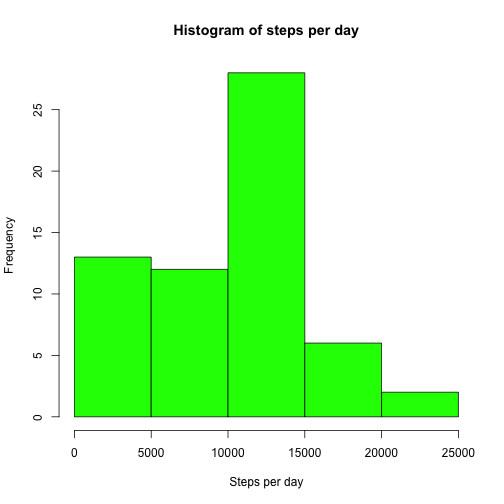
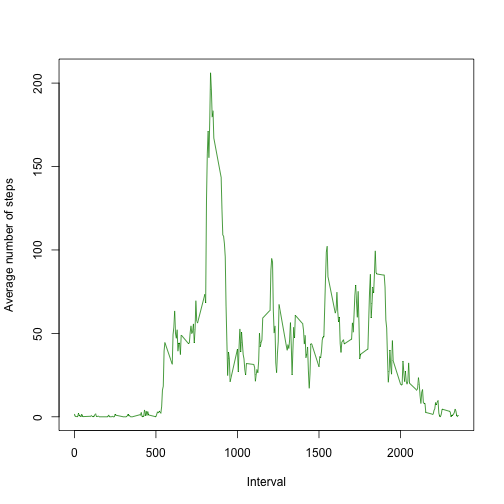
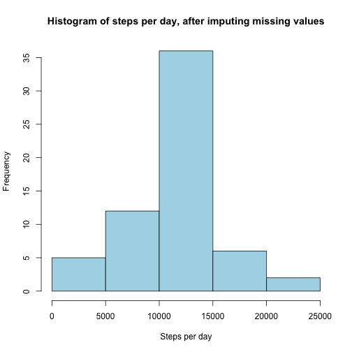
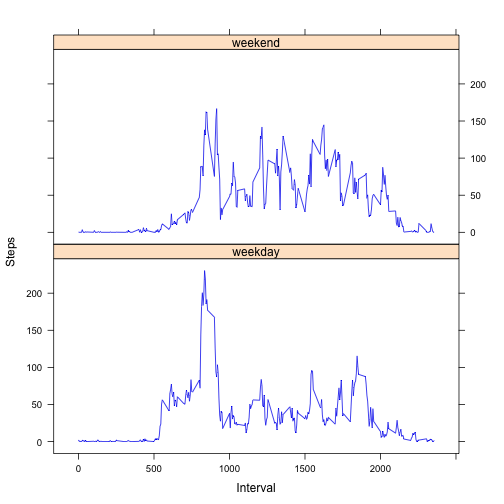

# Assignment 1 - Reproducible research

=========================================================


```r
# library(knitr)

## knit("assignment 1.Rmd")

# knit2html("assignment 1.Rmd")
# browseURL("assignment 1.html")
```

## Introduction

It is now possible to collect a large amount of data about personal movement using activity monitoring devices such as a Fitbit, Nike Fuelband, or Jawbone Up. These type of devices are part of the “quantified self” movement – a group of enthusiasts who take measurements about themselves regularly to improve their health, to find patterns in their behavior, or because they are tech geeks. But these data remain under-utilized both because the raw data are hard to obtain and there is a lack of statistical methods and software for processing and interpreting the data.  
This assignment makes use of data from a personal activity monitoring device. This device collects data at 5 minute intervals through out the day. The data consists of two months of data from an anonymous individual collected during the months of October and November, 2012 and include the number of steps taken in 5 minute intervals each day.

## Data

The data for this assignment was downloaded from the course web site.  
Dataset: Activity monitoring data [52K]  
The variables included in this dataset are:
* steps: Number of steps taking in a 5-minute interval (missing values are coded as NA)
* date: The date on which the measurement was taken in YYYY-MM-DD format
* interval: Identifier for the 5-minute interval in which measurement was taken

The dataset is stored in a comma-separated-value (CSV) file and there are a total of 17,568 observations in this dataset.

## Analysis

### Loading and preprocessing the data

Show any code that is needed to  
	1.	Load the data (i.e. read.csv())  	
	2.	Process/transform the data (if necessary) into a format suitable for your analysis  


```r
data <- read.csv("activity.csv")

summary(data)
```

```
##      steps                date          interval     
##  Min.   :  0.00   2012-10-01:  288   Min.   :   0.0  
##  1st Qu.:  0.00   2012-10-02:  288   1st Qu.: 588.8  
##  Median :  0.00   2012-10-03:  288   Median :1177.5  
##  Mean   : 37.38   2012-10-04:  288   Mean   :1177.5  
##  3rd Qu.: 12.00   2012-10-05:  288   3rd Qu.:1766.2  
##  Max.   :806.00   2012-10-06:  288   Max.   :2355.0  
##  NA's   :2304     (Other)   :15840
```

### What is mean total number of steps taken per day?  
For this part of the assignment, you can ignore the missing values in the dataset.  
	1. Calculate the total number of steps taken per day


```r
length(data$date)
```

```
## [1] 17568
```

```r
length(unique(data$date))
```

```
## [1] 61
```

```r
steps_per_day <- tapply(data$steps, data$date, sum, na.rm = TRUE)
steps_per_day
```

```
## 2012-10-01 2012-10-02 2012-10-03 2012-10-04 2012-10-05 2012-10-06 
##          0        126      11352      12116      13294      15420 
## 2012-10-07 2012-10-08 2012-10-09 2012-10-10 2012-10-11 2012-10-12 
##      11015          0      12811       9900      10304      17382 
## 2012-10-13 2012-10-14 2012-10-15 2012-10-16 2012-10-17 2012-10-18 
##      12426      15098      10139      15084      13452      10056 
## 2012-10-19 2012-10-20 2012-10-21 2012-10-22 2012-10-23 2012-10-24 
##      11829      10395       8821      13460       8918       8355 
## 2012-10-25 2012-10-26 2012-10-27 2012-10-28 2012-10-29 2012-10-30 
##       2492       6778      10119      11458       5018       9819 
## 2012-10-31 2012-11-01 2012-11-02 2012-11-03 2012-11-04 2012-11-05 
##      15414          0      10600      10571          0      10439 
## 2012-11-06 2012-11-07 2012-11-08 2012-11-09 2012-11-10 2012-11-11 
##       8334      12883       3219          0          0      12608 
## 2012-11-12 2012-11-13 2012-11-14 2012-11-15 2012-11-16 2012-11-17 
##      10765       7336          0         41       5441      14339 
## 2012-11-18 2012-11-19 2012-11-20 2012-11-21 2012-11-22 2012-11-23 
##      15110       8841       4472      12787      20427      21194 
## 2012-11-24 2012-11-25 2012-11-26 2012-11-27 2012-11-28 2012-11-29 
##      14478      11834      11162      13646      10183       7047 
## 2012-11-30 
##          0
```

	2. If you do not understand the difference between a histogram and a barplot, research the difference between them. Make a histogram of the total number of steps taken each day  


```r
hist(steps_per_day, col = "green", main = "Histogram of steps per day", xlab = "Steps per day")
```

 

	3. Calculate and report the mean and median of the total number of steps taken per day  


```r
mean(steps_per_day)
```

```
## [1] 9354.23
```

```r
median(steps_per_day)
```

```
## [1] 10395
```

### What is the average daily activity pattern?  
	1. Make a time series plot (i.e. type = "l") of the 5-minute interval (x-axis) and the average number of steps taken, averaged across all days (y-axis)  


```r
average_steps_per_interval <- tapply(data$steps, data$interval, mean, na.rm = TRUE)
# average_steps_per_interval

plot(names(average_steps_per_interval), average_steps_per_interval, type = "l", col = "green4", xlab = "Interval", ylab = "Average number of steps")
```

 

	2. Which 5-minute interval, on average across all the days in the dataset, contains the maximum number of steps?  
	

```r
names(average_steps_per_interval)[which(average_steps_per_interval == max(average_steps_per_interval))]
```

```
## [1] "835"
```
	
### Imputing missing values  
Note that there are a number of days/intervals where there are missing values (coded as NA). The presence of missing days may introduce bias into some calculations or summaries of the data.  
	1. Calculate and report the total number of missing values in the dataset (i.e. the total number of rows with NAs)  


```r
length(which(is.na(data$steps)))
```

```
## [1] 2304
```
	2. Devise a strategy for filling in all of the missing values in the dataset. The strategy does not need to be sophisticated. For example, you could use the mean/median for that day, or the mean for that 5-minute interval, etc.  


```r
data_split <- split(data, data$date)
data_split <- lapply(data_split, function(x) {x[which(is.na(x$steps)),]$steps <- mean(x$steps, na.rm = TRUE); return(x)})
```

```
## Error in `$<-.data.frame`(`*tmp*`, "steps", value = 0.4375): replacement has 1 row, data has 0
```
Tried to impute the mean of the day, but there exist days with all values missing, so this is not possible.  
Now try imputing the mean of the 5-minute interval.  

```r
data_split <- split(data, data$interval)
data_split <- lapply(data_split, function(x) {x[which(is.na(x$steps)),]$steps <- mean(x$steps, na.rm = TRUE); return(x)})
```

	3. Create a new dataset that is equal to the original dataset but with the missing data filled in.  


```r
data_new <- do.call(rbind, data_split)
```

	4. Make a histogram of the total number of steps taken each day and Calculate and report the mean and median total number of steps taken per day. Do these values differ from the estimates from the first part of the assignment? What is the impact of imputing missing data on the estimates of the total daily number of steps?  


```r
length(data_new$date)
```

```
## [1] 17568
```

```r
length(unique(data_new$date))
```

```
## [1] 61
```

```r
steps_per_day2 <- tapply(data_new$steps, data_new$date, sum, na.rm = TRUE)
steps_per_day2
```

```
## 2012-10-01 2012-10-02 2012-10-03 2012-10-04 2012-10-05 2012-10-06 
##   10766.19     126.00   11352.00   12116.00   13294.00   15420.00 
## 2012-10-07 2012-10-08 2012-10-09 2012-10-10 2012-10-11 2012-10-12 
##   11015.00   10766.19   12811.00    9900.00   10304.00   17382.00 
## 2012-10-13 2012-10-14 2012-10-15 2012-10-16 2012-10-17 2012-10-18 
##   12426.00   15098.00   10139.00   15084.00   13452.00   10056.00 
## 2012-10-19 2012-10-20 2012-10-21 2012-10-22 2012-10-23 2012-10-24 
##   11829.00   10395.00    8821.00   13460.00    8918.00    8355.00 
## 2012-10-25 2012-10-26 2012-10-27 2012-10-28 2012-10-29 2012-10-30 
##    2492.00    6778.00   10119.00   11458.00    5018.00    9819.00 
## 2012-10-31 2012-11-01 2012-11-02 2012-11-03 2012-11-04 2012-11-05 
##   15414.00   10766.19   10600.00   10571.00   10766.19   10439.00 
## 2012-11-06 2012-11-07 2012-11-08 2012-11-09 2012-11-10 2012-11-11 
##    8334.00   12883.00    3219.00   10766.19   10766.19   12608.00 
## 2012-11-12 2012-11-13 2012-11-14 2012-11-15 2012-11-16 2012-11-17 
##   10765.00    7336.00   10766.19      41.00    5441.00   14339.00 
## 2012-11-18 2012-11-19 2012-11-20 2012-11-21 2012-11-22 2012-11-23 
##   15110.00    8841.00    4472.00   12787.00   20427.00   21194.00 
## 2012-11-24 2012-11-25 2012-11-26 2012-11-27 2012-11-28 2012-11-29 
##   14478.00   11834.00   11162.00   13646.00   10183.00    7047.00 
## 2012-11-30 
##   10766.19
```

```r
hist(steps_per_day2, col = "lightblue", main = "Histogram of steps per day, after imputing missing values", xlab = "Steps per day")
```

 

```r
mean(steps_per_day2)
```

```
## [1] 10766.19
```

```r
median(steps_per_day2)
```

```
## [1] 10766.19
```

The distribution of the total number of steps per day has changed to a distribution more similar to the normal. The mean has become closer to the median and both have increased slightly.

### Are there differences in activity patterns between weekdays and weekends?

For this part the weekdays() function may be of some help here. Use the dataset with the filled-in missing values for this part.  
	1. Create a new factor variable in the dataset with two levels – “weekday” and “weekend” indicating whether a given date is a weekday or weekend day.  


```r
data_new$day <- weekdays(as.Date(data_new$date))
data_new$day_type <- "weekday"
data_new[which(data_new$day %in% c("Saturday", "Sunday")),]$day_type <- "weekend"
data_new$day_type <- as.factor(data_new$day_type)
table(data_new$day, data_new$day_type, useNA = "ifany")
```

```
##            
##             weekday weekend
##   Friday       2592       0
##   Monday       2592       0
##   Saturday        0    2304
##   Sunday          0    2304
##   Thursday     2592       0
##   Tuesday      2592       0
##   Wednesday    2592       0
```

	2. Make a panel plot containing a time series plot (i.e. type = "l") of the 5-minute interval (x-axis) and the average number of steps taken, averaged across all weekday days or weekend days (y-axis). See the README file in the GitHub repository to see an example of what this plot should look like using simulated data.  
	

```r
library(reshape2)
average_steps_per_interval2 <- melt(tapply(data_new$steps, list(data_new$interval, data_new$day_type), mean, na.rm = TRUE))
names(average_steps_per_interval2) <- c("interval", "day_type", "steps")

library(lattice)
xyplot(steps ~ interval | day_type, type = "l", data = average_steps_per_interval2, col = "blue2", xlab = "Interval", ylab = "Steps", layout = c(1, 2))
```

 

